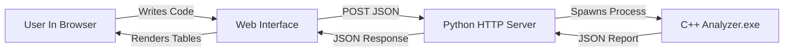

# Source Code Analyzer

A web-based tool for analyzing C-like source code, demonstrating compiler design principles including Lexical, Syntax, and Semantic analysis.

## 🚀 Project Overview

This project splits the responsibility of code analysis and user interface into two distinct layers:
1.  **Core Analysis (Backend)**: Written in **C++** for performance and explicit control over memory and logic.
2.  **User Interface (Frontend)**: Built with **HTML, CSS, and JavaScript** for a modern, responsive user experience.
3.  **Bridge (Server)**: A lightweight **Python** server connects the web UI to the C++ backend.

## 🏗️ System Architecture



### Why this architecture?
-   **Separation of Concerns**: The C++ backend focuses purely on compiler logic without worrying about UI rendering. The Web UI focuses on presentation without knowing how parsing works.
-   **Performance**: C++ is ideal for computationally intensive tasks like parsing and symbol table management.
-   **Simplicity**: Python acts as a minimal glue code, avoiding complex web frameworks for this specific use case.

## 📂 Components Explained

### 1. Backend (`/backend`) - C++
The brain of the operation. It reads source code and produces a structured JSON report.

*   **`lexer.cpp` / `lexer.h`**:
    *   **Role**: *Lexical Analysis* (Scanning).
    *   **How**: Reads raw text character by character and groups them into meaningful **Tokens** (e.g., `int` -> `KEYWORD`, `x` -> `IDENTIFIER`, `5` -> `NUMBER`).
*   **`parser.cpp` / `parser.h`**:
    *   **Role**: *Syntax Analysis* (Parsing).
    *   **How**: Uses **Recursive Descent Parsing** to verify if the tokens form valid sentences (grammar checking). It checks for missing semicolons, unbalanced braces, etc.
*   **`symbol_table.cpp` / `symbol_table.h`**:
    *   **Role**: *State Management*.
    *   **How**: Tracks variable declarations, types, and scopes. It ensures variables aren't used before declaration or redeclared in the same scope.
*   **`analyzer.cpp`**:
    *   **Role**: *Driver*.
    *   **How**: The main entry point. It chains the Lexer -> Parser -> JSON Output.

### 2. Frontend (`/web`) - HTML/CSS/JS
The face of the application.

*   **`index.html`**: The structure. Contains the clean split-view layout.
*   **`style.css`**: The look. Implements a dark, developer-friendly theme.
*   **`app.js`**: The logic. Captures user input, sends it to the server via `fetch`, and dynamically generates table rows from the returned JSON data.

### 3. Server (`server.py`) - Python
The connector.
*   **Role**: Wraps the Command Line Interface (CLI) of the C++ backend into a Web API.
*   **Why Python?**: It provides a simple `http.server` implementation in the standard library, meaning **no external dependencies** (like Node.js `node_modules`) are required.

## 🛠️ How to Run

### Prerequisities
-   **C++ Compiler** (g++ or clang)
-   **Python 3.x**

### Steps

1.  **Compile the Backend**:
    Open a terminal in the project root and run:
    ```bash
    g++ -o backend/analyzer.exe backend/analyzer.cpp backend/lexer.cpp backend/parser.cpp backend/symbol_table.cpp
    ```

2.  **Start the Server**:
    ```bash
    python server.py
    ```
    You should see: `Serving at http://localhost:3000`

3.  **Analyze**:
    Open your browser to `http://localhost:3000`.
    Type code and hit **Analyze**.

## 📝 Example Code to Test

```c
int x = 10;
if (x > 5) {
    int y = x + 1;
}
// Semantic Error: y is out of scope here
int z = x + y; 
```
